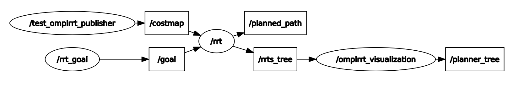

# RRT
Implementation of RRT* for Dubins vehicles.

## Publishers and Subscribers

The rrt node will subscribe the costmap and goal topics. It uses the costmap and goal configuration receives over the topics to publish a planned path for the vehicle. Additionally, the rrt_tree will also be published to be visualized in rviz. Running the `visualization.py` script will publish the tree over the planner_tree topic for rviz.

## Launch/Test files
Running the `rrt_node.test` launch file spins up the rrt node. It will idle until it detects that a costmap is being published over the costmap topic.

Running the `static_costmap_publisher.py` script creates the `/test_omplrrt` node which publishes a static costmap for the rrt node. The goal is published from the `rrt_node.test` launch file itself.

## Running an isolated instance
`source devel/setup.bash`
- Start the RRT node
  - `roslaunch rrt rrt_node.test`
- Start the static costmap publisher
  - `rosrun static_costmap_publisher.py`
- Start visualization and rrt
  - `rosrun visualization.py`
  - `rviz -d rrt_config.rviz`
